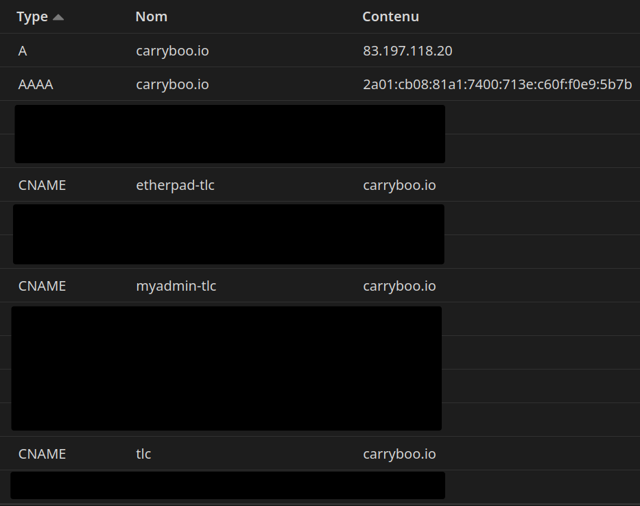

# TLC_project

Membres du groupe:
- Ramoné Benjamin
- Méranthe Damien
- Guerlesquin Valentin

---

Ce repo a pour but de contenir la partie déploiement sur K8S du projet TLC.

***Les services sont accessibles ici :*** 
- https://tlc.carryboo.io
- https://etherpad-tlc.carryboo.io
- https://myadmin-tlc.carryboo.io (id: tlc; mdp: tlc)


# Diagramme global (TLC-chart) :


Le serveur est un serveur privé, hébergé chez moi (Valentin), sous le nom de domaine carryboo.io  

Les fichiers et codes de configuration montrés ci-dessous sonc regroupés dans le dossier ```confs``` pour être plus facilement consultables.   

Le traffic venant du web entre par ma box, et est filtré directement. Seul les ports 80,443,6443 et un port SSH modifié (non montré) sont transférés vers le serveur.   
   

Le traffic web est ensuite capté par un reverse-proxy HAproxy :
#### *confs/haproxy/haproxy.cfg*
```
global
    log         /dev/log local0

    chroot      /var/lib/haproxy
    pidfile     /var/run/haproxy.pid
    maxconn     4000
    user        haproxy
    group       haproxy
    daemon

    # turn on stats unix socket
    stats socket /var/lib/haproxy/stats

    # utilize system-wide crypto-policies
    ssl-default-bind-ciphers PROFILE=SYSTEM
    ssl-default-server-ciphers PROFILE=SYSTEM

defaults
    mode                    http
    log                     global
    option                  httplog
    #option forwardfor       except 127.0.0.1
    #option forwardfor	    except ::1
    option                  redispatch
    retries                 3
    timeout http-request    10s
    timeout queue           1m
    timeout connect         10s
    timeout client          1m
    timeout server          1m
    timeout http-keep-alive 10s
    timeout check           10s
    maxconn                 3000

#######################################################################

frontend http
	bind *:80,:::80
	bind *:443,:::443 ssl crt /etc/haproxy/certs/fullchain.pem
	mode http
	option httplog
	http-request capture req.hdr(Host) len 30
	log-format "%ci:%cp [%tr] %ft %b/%s %hr %hs %TR/%Tw/%Tc/%Tr/%Ta %ST %B %CC %CS %tsc %ac/%fc/%bc/%sc/%rc %sq/%bq %{+Q}r"
	http-request redirect scheme https unless { ssl_fc }
	use_backend %[req.hdr(host),lower,map_dom(/etc/haproxy/maps/hosts.map,web)]

#######################################################################
	
#####
# OTHER BACKENDS
#####

backend k3s
	option forwardfor
	http-request add-header X-forwarded-Proto https if { ssl_fc }
	server k3s-cluster 192.168.1.100:8000 maxconn 32

#####
# OTHER BACKENDS
#####
```

Dans le cas HTTPS les certificats sont gérés par un certbot LetsEncrypt tournant sur le serveur, qui les renouvelle automatiquement:       
#### *confs/letsencrypt/carryboo.io.conf*
```yaml
# renew_before_expiry = 30 days
version = 2.3.0
archive_dir = /etc/letsencrypt/archive/carryboo.io
cert = /etc/letsencrypt/live/carryboo.io/cert.pem
privkey = /etc/letsencrypt/live/carryboo.io/privkey.pem
chain = /etc/letsencrypt/live/carryboo.io/chain.pem
fullchain = /etc/letsencrypt/live/carryboo.io/fullchain.pem

# Options used in the renewal process
[renewalparams]
account = #HIDDEN
authenticator = dns-cloudflare
server = https://acme-v02.api.letsencrypt.org/directory
key_type = #HIDDEN
dns_cloudflare_credentials = /etc/letsencrypt/dns-credentials/token
```

Les 3 domaines utilisés pour ce projet sont les suivants :
- https://tlc.carryboo.io
- https://etherpad-tlc.carryboo.io
- https://myadmin-tlc.carryboo.io

   

Le HAproxy agit comme une API-gateway, il match le champ Host de la requête avec une map Domain/Backend, et redirige la requête sur le Backend souhaité :
#### *confs/haproxy/hosts.map*
```yaml
#DomainName			BackendName

tlc.carryboo.io			k3s
etherpad-tlc.carryboo.io	k3s
myadmin-tlc.carryboo.io		k3s
```  


Dans le cadre de ce projet, la partie doodle est hébergée sur un cluster K3S, dont les ports d'entrée vers le reverse-proxy Traefik ont été modifiés pour éviter un conflit avec le HAproxy :
#### *confs/k3s/traefik-config.yaml*
```yaml
apiVersion: helm.cattle.io/v1
kind: HelmChartConfig
metadata:
  name: traefik
  namespace: kube-system
spec:
  valuesContent: |-
    ports:
      web:
        exposedPort: 8000
        expose: true
      websecure:
        exposedPort: 8443
        expose: true
    logs:
      general:
        level: DEBUG
    additionaArguments:
      - "--providers.kubernetescrd.allowCrossNamespace=true"
```


On arrive ensuite sur le reverse-proxy Traefik. Ce dernier se base sur des ingressRules pour rediriger le traffic vers le reverse-proxy NGINX, présent dans le conteneur du front doodle :

#### *confs/traefik/tlc-ingress.yaml*
```yaml
apiVersion: traefik.containo.us/v1alpha1
kind: IngressRoute
metadata:
  name: tlc-ingressroute
  namespace: tlc
spec:
  entryPoints:
    - web
    - websecure
  routes:
  - kind: Rule
    match: Host(`tlc.carryboo.io`)
    services:
    - kind: Service
      name: front
      namespace: tlc
      passHostHeader: true
      port: 80
  - kind: Rule
    match: Host(`etherpad-tlc.carryboo.io`)
    services:
    - kind: Service
      name: front
      namespace: tlc
      passHostHeader: true
      port: 80
  - kind: Rule
    match: Host(`myadmin-tlc.carryboo.io`)
    services:
    - kind: Service
      name: front
      namespace: tlc
      passHostHeader: true
      port: 80
```

Enfin, les requêtes sont dispatchées par NGINX, en se basant sur le hostname d'entrée et la requête URI, vers les différents services :

#### confs/nginx/nginx.conf
```
events {
        worker_connections 1024;
    }

http {

    access_log  /var/log/nginx/access.log;
    error_log  /var/log/nginx/error.log;
    
    server {
        listen       80;
        listen  [::]:80;
        server_name  tlc.carryboo.io;

        location /api {
            proxy_pass http://api:8080/api;
            proxy_set_header Host $http_host;
	    proxy_set_header X-Forwarded-Proto https;
        }

        location / {
            root   /usr/share/nginx/html;
            index  index.html index.htm;
            try_files $uri $uri/ /index.html?$args;
        }

        error_page  404              /404.html;

        error_page   500 502 503 504  /50x.html;
        location = /50x.html {
            root   /usr/share/nginx/html;
        }

    }

    server {
        listen       80;
        listen  [::]:80;
        server_name  myadmin-tlc.carryboo.io;

        location /{
            proxy_pass http://myadmin:80;
            proxy_set_header Host $http_host;
	    proxy_set_header X-Forwarded-Proto https;

        }

        error_page   500 502 503 504  /50x.html;
        location = /50x.html {
            root   /usr/share/nginx/html;
        }
    }

    server {
        listen       80;
        listen  [::]:80;
        server_name  etherpad-tlc.carryboo.io;
        location / {
            proxy_pass http://etherpad:9001;
            proxy_set_header Host $http_host;
            proxy_http_version 1.1;
            proxy_set_header Upgrade $http_upgrade;
            proxy_set_header Connection "upgrade";
            proxy_set_header X-Real-IP  $remote_addr;
            proxy_set_header X-Forwarded-For $remote_addr;
            proxy_set_header X-Forwarded-Proto https;
        }

        error_page   500 502 503 504  /50x.html;
        location = /50x.html {
            root   /usr/share/nginx/html;
        }
    }
}
```

Le déploiement du doodle se fait grâce à un chart Helm custom, présent dans le dossier ```helm``` à la racine de ce repo.

Il déploie la liste de composants suivante : 
                                                                             
- db:
    - configmap
    - déploiement 
    - private volume
    - private volume claim 
    - secret 
    - service 
- front:
    - déploiement 
    - service 
- back:
    - déploiement
    - service
- ether:
    - configmap
    - déploiement 
    - service 
- mail:
    - déploiement 
    - service 
- phpmyadmin:
    - déploiement 
    - service 
- ingressRule (tlc, ether-tlc, myadmin-tlc)
- serviceAccount   

Tous les déploiements utilisent 1 seul pod, sauf le back, qui est répliqué sur 3 pods :   


Ce chart Helm pull les images docker depuis un registry privé **Harbor**, lui aussi hébergé dans ce cluster K3S et déployé grâce à Helm, et disponible à l'adresse ***https://registry.carryboo.io***   
*(Le code du fichier values.yaml utilisé étant très long, je ne l'affiche pas, mais il est dans /confs/harbor/)*
Les images docker construites pour le back et le front sont optimisées pour faire le minimum de place possible. On utilise pour cela des wrappers basés sur alpine, et un build en plusieurs étapes, qui nous permet de garder uniquement le code nécessaire, sans les reliquats de compilation:

#### **image back:**
```Dockerfile
## BUILDING phase
FROM alpine:3.17 AS build

RUN apk add --no-cache maven git

##Clone repo
RUN git clone https://github.com/damienMS/doodlestudent.git

WORKDIR /doodlestudent/api

RUN git checkout develop

##Compile the back
RUN mvn clean package -Dquarkus.package.type=uber-jar


## RUN phase
FROM alpine:3.17

RUN apk add --no-cache openjdk11

##Add it on the Run image and start it 
COPY --from=build /doodlestudent/api/target/tlcdemoApp-1.0.0-SNAPSHOT-runner.jar /target/

CMD [ "java", "-jar", "/target/tlcdemoApp-1.0.0-SNAPSHOT-runner.jar" ]
```
#### **image front:**
```Dockerfile
## BUILD phase
FROM node:12-alpine AS build

RUN apk add --no-cache git

## Cloning the repository
RUN git clone https://github.com/damienMS/doodlestudent.git

## Going to the front directory
WORKDIR /doodlestudent/front

## Installing the dependencies
RUN npm install

## Compiling the project
RUN npm run build

## RUN phase
FROM nginx:1-alpine
COPY --from=build /doodlestudent/front/dist/tlcfront /usr/share/nginx/html
COPY nginx.conf /etc/nginx/nginx.conf
```

Ces images sont compilées grâce à des Github Actions déclenchées en cas de changement dans les dossiers ```doodlestudent/api``` et ```doodlestudent/front``` repectivement, et le déploiement est mis à jour dans ces même Github Actions via Helm.  
Toujours dans le but d'héberger la majorité des composants de ce projet, les Github Actions sont effectuées directement sur le serveur en self-hosted, car il est configuré comme runner pour ce repo. ["(runner)"](https://github.com/Carrybooo/TLC_project/settings/actions/runners/2)
#### ./github/workflows/build-update-front.yml
```yaml

name: build-update-back

on:
  workflow_dispatch:
  push:
    branches:
    - main
    paths:
    - doodlestudent/api/**

jobs:
  deploy:
    runs-on: ubuntu-latest

    env:
      KUBECONFIG_FILE: '${{ secrets.CARRYBOO_KUBECONFIG }}'

    steps:
    - name: Checkout
      uses: actions/checkout@v2

    - name: Set up Docker Buildx
      uses: docker/setup-buildx-action@v1

    - name: Login to private registry
      uses: docker/login-action@v1
      with:
        registry: registry.carryboo.io
        username: ${{ secrets.REGISTRY_USERNAME }}
        password: ${{ secrets.REGISTRY_PASSWORD }}

    - name: Build and push
      uses: docker/build-push-action@v2
      with:
        context: ./doodlestudent/docker/back/
        file: ./doodlestudent/docker/back/Dockerfile
        builder: ${{ steps.buildx.outputs.name }}
        push: true
        tags: '${{ secrets.REGISTRY_URL }}/tlc_light/tlc_back:latest'

    - uses: azure/k8s-set-context@v1
      with:
        method: kubeconfig
        kubeconfig: ${{ secrets.CARRYBOO_KUBECONFIG }}
        context: default

    - name: Install kubectl
      uses: azure/setup-kubectl@v3
      with:
        version: 'v1.25.6'

    - name: Installing Helm
      run: curl https://raw.githubusercontent.com/helm/helm/main/scripts/get-helm-3 | bash

    - name: Update doodle with Helm
      run: |
        echo "$KUBECONFIG_FILE" > /tmp/kubeconfig.yml
        export KUBECONFIG=/tmp/kubeconfig.yml
        helm dependency update
        helm upgrade --install doodlestudent ./helm/doodlestudent/ -n tlc --create-namespace
```


### MONITORING

Pour ce qui est du monitoring, actuellement, le cluster n'est pas monitoré directement. Le monitoring se fait directement sur le serveur via Netdata, qui permet de récupérer et afficher des métriques facilement:


Le but était de rajouter une instance spécifique dans le cluster mais le temps a manqué pour aller plus loin.

C'est tout pour nous ! 
